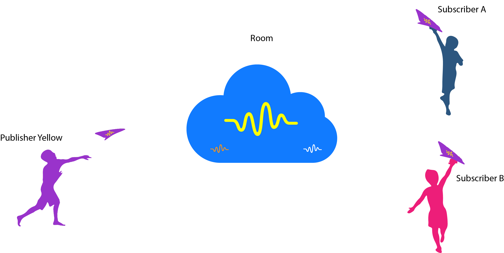

<p align="center">

</p>


[  ](https://bintray.com/bandyer/Android-CoreAV/Android-CoreAV/_latestVersion)[](https://bandyer.github.io/Android-CoreAV/)
[](https://twitter.com/intent/follow?screen_name=bandyersrl)


Bandyer is a young innovative startup that enables audio/video communication and collaboration from any platform and browser! Through its WebRTC architecture, it makes video communication simple and punctual. 


---

. **[Overview](#overview)** .
**[Features](#features)** .
**[Requirements](#requirements)** .
**[Installation](#installation)** .
**[Quickstart](#quickstart)** .
**[Documentation](#documentation)** .
**[Support](#support)** .
**[Credits](#credits)** .

---

## Overview

Imagine that you would like to make audio/video calls. You may have heard of an open source solution known as [WebRTC](https://webrtc.org/). 

If you know what we are talking about, then you already know the huge effort that is required to integrate **WebRTC**.

While **WebRTC** may be open and free it does not make your life as a developer as easy as it should be.

In Bandyer-CoreAV we have decided to represent a call with 3 Major entities.

* **Room** - The place where publishers and subscribers meet.
* **Publisher** - An user that wants to add his audio/video in the room.
* **Subscriber** - An user that wants to see the audio/video of a publisher in the room.

### Let's see a typical scenario 

In this scenario a user wants to stream his video to 2 friends.



## Features
* It's easy to use
* No need to understand WebRTC flows
* High-reliability
* Small-sized
* Fully covered by Unit-Tests
* Written in Kotlin
* Advanced proprietary features not available in standard WebRTC


## Requirements

Supports from API level 16 (Android 4.1 Jelly Bean).

**Requires compileOptions for Java8**
```java
android {
    compileOptions {
        sourceCompatibility JavaVersion.VERSION_1_8
        targetCompatibility JavaVersion.VERSION_1_8
    }
}
```
## Latest releases

Java && AndroidX >= **v1.3.0**

Java && AppCompat <= **v1.2.5**

## Installation

Download the [latest AAR](https://bintray.com/bandyer/Android-CoreAV/Android-CoreAV) or grab via Gradle:

```groovy
implementation 'com.bandyer:core_av:1.4.2'
```

## Quickstart

In your **Application** class:

```java
public class App extends Application {
    @Override
    public void onCreate() {
        super.onCreate();
        BandyerCoreAV.initWithDefaults(this);
    }
}
```

Create **activity_main.xml** in **res/layout/**

```xml
<RelativeLayout xmlns:android="http://schemas.android.com/apk/res/android"
    android:layout_width="match_parent"
    android:layout_height="match_parent"
    android:orientation="vertical">

    <com.bandyer.core_av.view.BandyerView
        android:id="@+id/publisherView"
        android:layout_width="match_parent"
        android:layout_height="match_parent" />

    <HorizontalScrollView
        android:layout_width="match_parent"
        android:layout_height="wrap_content"
        android:layout_alignParentBottom="true">

        <LinearLayout
            android:id="@+id/subscribersListView"
            android:layout_width="wrap_content"
            android:layout_height="wrap_content"
            android:orientation="horizontal" />
    </HorizontalScrollView>

</RelativeLayout>
```

Change your **MainActivity.java**

```java
public class MainActivity extends AppCompatActivity implements RoomObserver, SubscriberObserver, PublisherObserver {

    // the token will be provided to you by a rest call
    private static final String TOKEN = "Bandyer-Token";

    private Room room;
    private Publisher publisher;

    // Layout elements
    private LinearLayout subscribersListView;
    private BandyerView publisherView;

    @Override
    protected void onCreate(@Nullable Bundle savedInstanceState) {
        super.onCreate(savedInstanceState);
        setContentView(R.layout.activity_main);
        subscribersListView = findViewById(R.id.subscribersListView);
        publisherView = findViewById(R.id.publisherView);

        // Let's create a video call!!
        room = Room.Registry.get(new RoomToken(TOKEN));
        room.addRoomObserver(this);
        room.join();
    }

    /**
     * Once we have joined the call room
     * Let's add a publisher that will stream from the Frontal Camera
     */
    @Override
    public void onRoomEnter() {
        Log.d("Room", "onRoomEnter");

        // TODO: Publisher needs runtime permissions for AUDIO/VIDEO, otherwise it won't stream anything
        Capturer capturerAV = Capturer.Registry.get(this, new CapturerOptions.Builder().withAudio().withCamera());
        capturerAV.start();
        publisher = room.create(new RoomUser("aliasKris", "kristiyan", "petrov", "kris@bandyer.com", "image"))
                .addPublisherObserver(MainActivity.this)
                .setCapturer(capturerAV);
        room.publish(publisher);
        publisher.setView(publisherView, new OnStreamListener() {
            @Override
            public void onReadyToPlay(@NonNull StreamView view, @NonNull Stream stream) {
                view.play(stream); 
            }
        });
    }
    
    @Override
    public void onRoomReconnecting() {
        Log.d("Room", "onRoomReconnecting ...");
    }

    @Override
    public void onRoomStateChanged(@NonNull RoomState state) {
        Log.d("Room", "onRoomStateChanged " + state.name());
    }

    @Override
    public void onRoomExit() {
        Log.d("Room", "onRoomExit");
    }

    @Override
    public void onRoomError(@NonNull String reason) {
        Log.e("Room", reason);
    }

    @Override
    protected void onDestroy() {
        super.onDestroy();
        // close the call
        Capturer.Registry.destroy();
        Room.Registry.destroyAll();
    }
    
    /**
    * The local publisher has started to stream in the room
    *
    * @param publisher the publisher created in this activity
    */
    @Override
    public void onLocalPublisherJoined(@NonNull Publisher publisher) {
        Log.d("Publisher", "onLocalPublisherJoined");
    }

    /**
     * A new publisher has started to stream in the room
     * Let's add a subscriber for each published stream
     *
     * @param stream remote audio/video stream
     */
    @Override
    public void onRemotePublisherJoined(@NonNull final Stream stream) {
        Log.d("Publisher", "onRemotePublisherJoined");

        final Subscriber subscriber = new Subscriber(stream).addSubscribeObserver(this);
        room.subscribe(subscriber);

        // set the view where the stream will be played
        final BandyerView subscriberView = new BandyerView(this);
        int size = getDp(60);

        subscribersListView.addView(subscriberView, new LinearLayout.LayoutParams(size, size));
        subscriber.setView(subscriberView, new OnStreamListener() {
            @Override
            public void onReadyToPlay(@NonNull StreamView view, @NonNull Stream stream) {
                subscriberView.play(stream);
                subscriberView.bringToFront(true);
            }
        });
    }

    private int getDp(int size) {
        return (int) TypedValue.applyDimension(TypedValue.COMPLEX_UNIT_DIP, size, getResources().getDisplayMetrics());
    }

    /**
     * If a remote publisher has left we should remove the subscriber related
     *
     * @param stream remote stream
     */
    @Override
    public void onRemotePublisherLeft(@NonNull Stream stream) {
        Log.d("Publisher", "onRemotePublisherLeft");
        Subscriber subscriber = room.getSubscriber(stream);
        if (subscriber == null)
            return;
        room.unsubscribe(subscriber);
    }

    @Override
    public void onLocalSubscriberAdded(@NonNull Subscriber subscriber) {
        Log.d("Subscriber", "onLocalSubscriberAdded");
    }

    @Override
    public void onLocalSubscriberError(@NonNull Subscriber subscriber, @NonNull String reason) {
        Log.e("Subscriber", reason);
    }
    
    @Override
    public void onLocalSubscriberStateChanged(Subscriber subscriber, SubscriberState subscriberState) {
        Log.d("Subscriber", "onLocalSubscriberStateChanged" + subscriberState.name());
    }

    @Override
    public void onLocalPublisherAdded(@NonNull Publisher publisher) {
        Log.d("Publisher", "onLocalPublisherAdded");
    }
    
    @Override
    public void onLocalPublisherRemoved(@NonNull Publisher publisher) {
        Log.d("Publisher", "onLocalPublisherRemoved");
    }
    
    @Override
    public void onLocalPublisherStateChanged(@NonNull Publisher publisher, @NonNull PublisherState publisherState) {
        Log.d("Publisher", "onLocalPublisherStateChanged" + publisherState.name());
    }

    @Override
    public void onLocalPublisherError(@NonNull Publisher publisher, @NonNull String reason) {
        Log.e("Publisher", reason);
    }

    @Override
    public void onLocalPublisherStateChanged(Publisher publisher, PublisherState publisherState) {
        Log.d("Publisher", "onLocalPublisherStateChanged" + publisherState.name());
    }
    
    @Override
    public void onRemotePublisherUpdateStream(@NonNull Stream stream) {

    }

    @Override
    public void onLocalSubscriberJoined(@NonNull Subscriber subscriber) {

    }

    @Override
    public void onLocalSubscriberUpdateStream(@NonNull Subscriber subscriber) {

    }

    @Override
    public void onLocalSubscriberAudioMuted(@NonNull Subscriber subscriber, boolean muted) {

    }

    @Override
    public void onLocalSubscriberVideoMuted(@NonNull Subscriber subscriber, boolean muted) {

    }

    @Override
    public void onLocalSubscriberStartedScreenSharing(@NonNull Subscriber subscriber, boolean started) {

    }
    
}
```

## Documentation

You can find the complete documentation in two different styles

Kotlin Doc: [https://bandyer.github.io/Bandyer-Android-CoreAV/kDoc/](https://bandyer.github.io/Bandyer-Android-CoreAV/kDoc/)

Java Doc: [https://bandyer.github.io/Bandyer-Android-CoreAV/jDoc/](https://bandyer.github.io/Bandyer-Android-CoreAV/jDoc/)

## Support
To get basic support please submit an [Issue](https://github.com/Bandyer/Bandyer-Android-CoreAV/issues) 

If you prefer commercial support, please contact [bandyer.com](https://bandyer.com) by mail: <mailto:info@bandyer.com>.


## Credits
- [WebRTC](https://webrtc.org/) by Google, Mozilla, Opera, W3C and ITF
- [Gson](https://github.com/google/gson) by Google
- [Android-weak-handler](https://github.com/badoo/android-weak-handler) by Badoo
- [Socket.io](https://github.com/socketio/socket.io-client-java) by socket.io
